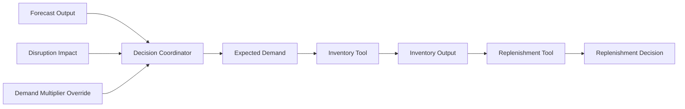
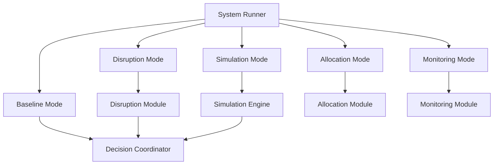
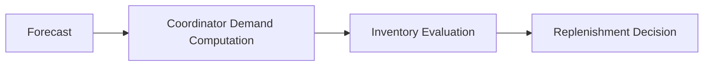
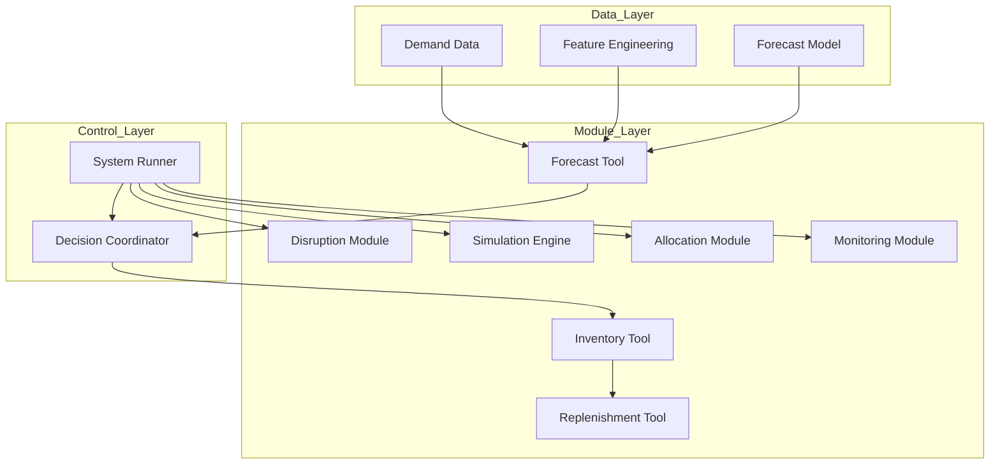
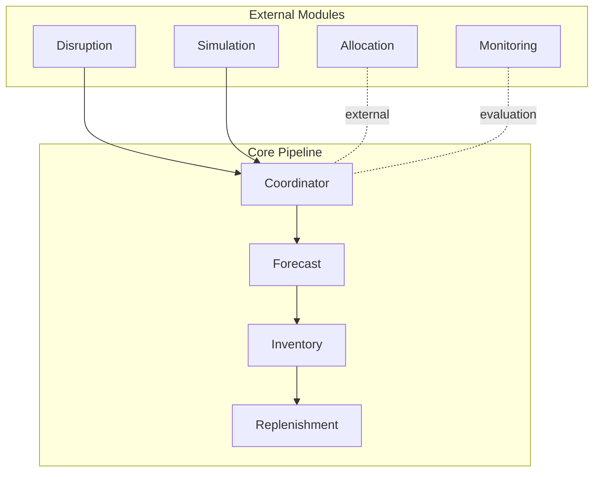
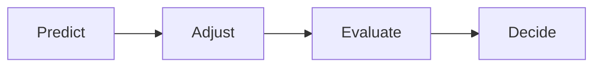

# Supply Chain Decision Pipeline — Architecture

This system is a **deterministic, modular supply chain decision pipeline** that transforms demand into inventory decisions.

Core flow:

forecast → inventory → replenishment

Execution is controlled by a **Decision Coordinator**, and orchestration across scenarios is handled by the **System Runner**.

---

## One-Line Summary

A coordinator-driven pipeline where demand is computed centrally, modules execute sequentially, and external capabilities (simulation, disruption, allocation, monitoring) operate outside the core flow.

---

## End-to-End Flow

---

## Coordinator Logic (Causal Flow)

### Coordinator Responsibilities

- execute modules in correct order  
- recompute expected demand from forecast  
- apply optional demand adjustments  
- construct clean inputs for downstream modules  
- return decision + trace  

### Rules

- forecast is not directly passed to inventory  
- expected demand is always computed inside coordinator  
- adjustments are optional inputs:
  - disruption impact  
  - demand multiplier override  
- inventory and replenishment only consume coordinator outputs  

---

## System Runner (Execution Modes)

### Runner Responsibilities

- selects execution mode  
- routes flow correctly  
- keeps core pipeline unchanged  

### Rules

- coordinator always executes core pipeline  
- disruption produces impact → then coordinator runs  
- simulation produces overrides → then coordinator runs  
- allocation operates outside core pipeline (multi-location)  
- monitoring evaluates state, not decisions  

---

## Dependency Flow

---

## Layered Architecture

---

## Data Representation Separation

### DataFrame World

- data loading  
- transformation  
- feature engineering  
- model computation  

### Dataclass World

- module inputs  
- module outputs  
- system interfaces  

### Why

- DataFrames are optimized for computation  
- dataclasses enforce stable system boundaries  
- prevents leakage of raw computation into decision interfaces  

---

## Module Positioning

---

## Key Principles

- coordinator owns demand computation  
- pipeline is strictly sequential  
- system runner controls orchestration  
- external modules do not alter pipeline structure  
- clear separation between computation and interfaces  

---

## Common Failure Modes

- skipping inventory step  
- passing forecast directly to replenishment  
- embedding allocation inside pipeline  
- letting simulation alter core logic  
- mixing orchestration into modules  
- using DataFrames as system interfaces  

---

## Mental Model

Forecast → Coordinator → Inventory → Replenishment