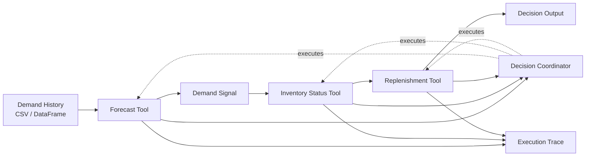
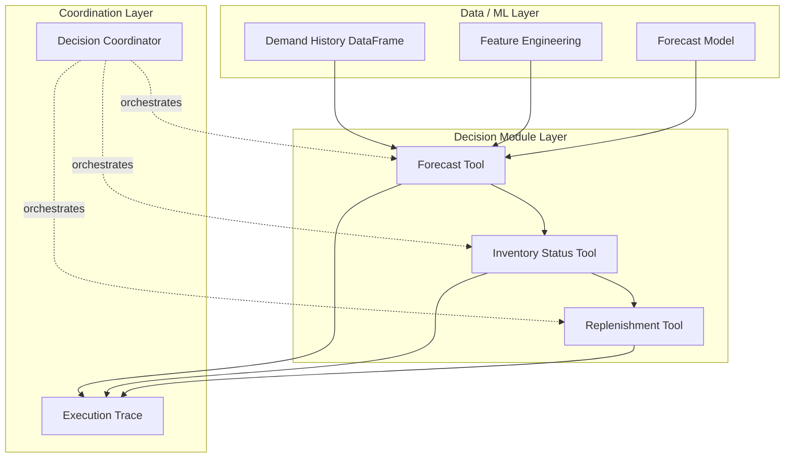
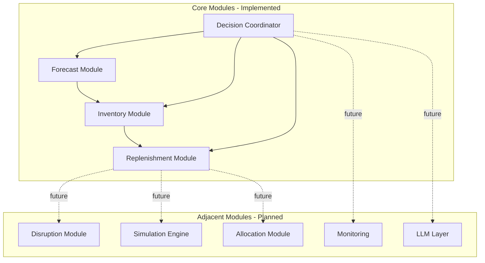
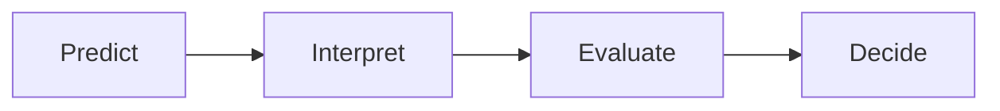

# Supply Chain Decision Pipeline — Architecture

This system is a **deterministic, modular supply chain decision pipeline** that transforms historical demand into executable inventory decisions.

It follows a **sequential dependency structure**:

forecast → inventory → replenishment

The architecture intentionally separates:

- data computation
- decision modules
- execution control

This makes the pipeline **traceable, extensible, and aligned with real supply chain decision flow**.

---

## One-Line Summary

A modular, deterministic supply chain decision system that separates ML computation, business decision logic, and orchestration through clear interfaces.

---

## End-to-End Pipeline

---

## Pipeline Explanation

The system executes as a **dependency-driven decision pipeline** in which each step consumes the output of the previous step.

### 1. Demand History
Historical demand is loaded for a specific SKU-location pair.

### 2. Forecast Tool
The forecast module uses historical demand to generate forward-looking demand predictions.

### 3. Demand Signal
Forecast output is converted into a simplified, decision-ready demand estimate that downstream modules can use consistently.

### 4. Inventory Status Tool
The inventory module evaluates inventory relative to expected demand and produces:

- inventory position  
- days of supply  
- stockout risk  

### 5. Replenishment Tool
The replenishment module converts the inventory assessment into an action:

- whether to reorder  
- recommended order quantity  
- reason codes  

### 6. Decision Coordinator
The coordinator controls execution by:

- enforcing the correct order  
- passing outputs between modules  
- recording execution trace  

**Key rule:** each module depends on upstream context; no module operates in isolation.

---

## Decision Dependency Flow

---

## Layered Architecture

---

## Data Representation Separation

The architecture intentionally uses two representation layers.

### DataFrame World
Used for:

- data loading  
- transformation  
- feature creation  
- model computation  

Flexible and computation-focused.

### Dataclass World
Used for:

- module inputs  
- module outputs  
- stable system interfaces  

Strict and interface-focused.

### Why this separation exists

- DataFrames are optimized for computation  
- Dataclasses enforce clean system boundaries  

The goal is to prevent raw computation objects from becoming system interfaces.

---

## Module Map

---

## Architecture Reasoning

- modules create clear boundaries and enable replacement  
- the coordinator centralizes execution control and maintains consistency  
- deterministic-first design ensures reliability, traceability, and debuggability  

---

## Validation

- data flows sequentially: forecast → inventory → replenishment  
- SKU and location remain aligned across the pipeline  
- each module has a single responsibility  
- the system is modular and extensible  

---

## Common Failure Modes

- sending forecast directly to replenishment without inventory evaluation  
- ignoring inventory context in decision making  
- mixing DataFrame computation with module contracts  
- hardcoding execution inside modules  
- losing SKU/location alignment  

---

## Mental Model (Quick Recall)

Forecast → Demand Signal → Inventory → Replenishment

---

## Readiness Check

The system is:

- stable and deterministic  
- correctly wired end-to-end  
- modular and extensible  
- aligned with real supply chain decision logic  

Ready for extension into disruption, simulation, and allocation layers.