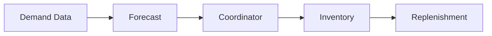
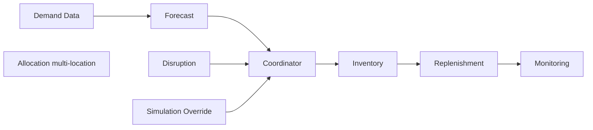
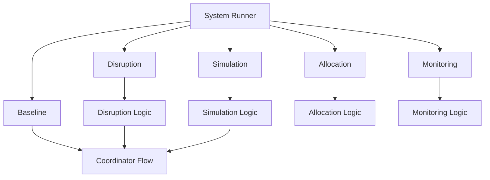
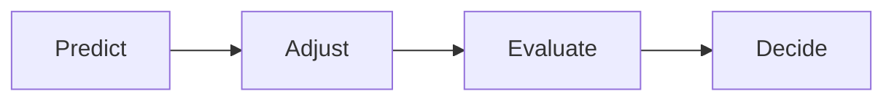

# Supply Chain AI Lab — System Architecture

## Purpose

This document shows how the system works end-to-end in a **simple and clear way**.

It focuses on:
- how decisions are made  
- how the system runs  
- what each part is responsible for  

---

## One-Line Summary

A system where:
- the **core pipeline makes decisions**
- the **coordinator controls execution and demand**
- the **system runner decides how the system runs**
- everything else either **modifies inputs** or **evaluates outputs**

---

## Core Decision Flow

---

## Full System Flow

---

## How the System Runs

---

## How to Read This

- Left → right = actual decision flow  
- Coordinator is the only place where demand is computed  
- Disruption and simulation modify demand before inventory  
- Allocation is separate (multi-location problem)  
- Monitoring happens after decisions  
- System runner selects which path to execute  

---

## Roles (Simple)

- **Forecast** → predicts demand  
- **Coordinator** → computes demand and controls flow  
- **Inventory** → evaluates stock vs demand  
- **Replenishment** → decides reorder  
- **System Runner** → chooses execution mode  
- **Disruption / Simulation** → modify inputs  
- **Allocation** → handles multi-location decisions  
- **Monitoring** → evaluates outcomes  

---

## What This System Covers

- demand prediction  
- inventory evaluation  
- replenishment decisions  
- scenario testing (simulation)  
- risk handling (disruption)  
- multi-location allocation  
- performance monitoring  

---

## Mental Model

Forecast → Coordinator → Inventory → Replenishment

---

## Summary

- core pipeline = decision engine  
- coordinator = control point  
- system runner = entry point  
- external modules stay outside core flow  
