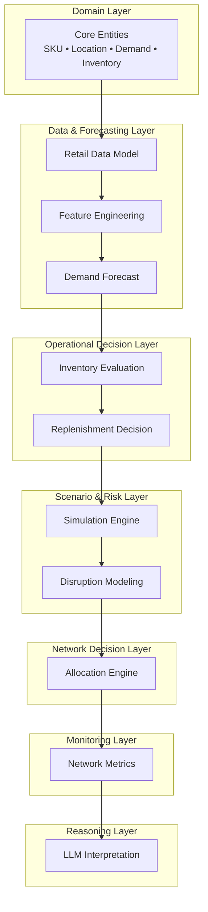
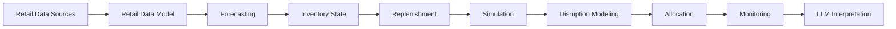
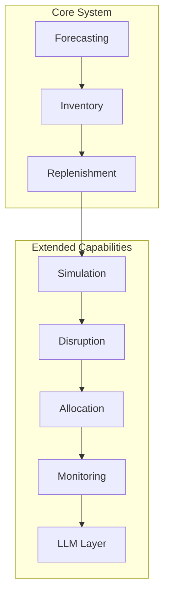

# Supply Chain AI Lab — System Architecture

## Purpose

This document describes the **overall architecture of the Supply Chain AI Lab**.

It represents how a real **AI-driven retail supply chain decision system** is structured end-to-end.

The system integrates:

- demand forecasting
- inventory evaluation
- replenishment decisions
- scenario simulation
- disruption modeling
- constrained allocation
- monitoring
- LLM-based reasoning

This file provides a **top-level system view**. Detailed behavior is defined in the module-specific architecture files.

---

## One-Line Summary

A layered, deterministic supply chain system that combines ML, decision logic, simulation, and monitoring into a single coherent pipeline.

---

## System Philosophy

The system follows a **deterministic-first architecture**.

- core decisions are produced by models and policies
- LLMs are used only for interpretation and explanation

This ensures the system is:

- transparent
- modular
- interpretable
- reproducible

---

## Core Decision Flow

The system operates as a structured decision flow:

Demand Forecast  
→ Inventory Evaluation  
→ Replenishment Decision  
→ Simulation  
→ Disruption Modeling  
→ Allocation  
→ Monitoring  
→ LLM Interpretation  

Each stage adds context and improves decision quality.

---

## High-Level Architecture Layers




---

## Layer Responsibilities

### Domain Layer
Defines the core business entities used across the system:

- SKU
- location
- demand
- inventory
- replenishment policy

### Data & Forecasting Layer
Transforms raw retail data into predictive demand signals:

- retail data modeling
- feature generation
- demand forecasting

### Operational Decision Layer
Converts predictive signals into operational decisions:

- inventory evaluation
- replenishment decisions

### Scenario & Risk Layer
Tests policy behavior under uncertainty:

- simulation experiments
- disruption modeling

### Network Decision Layer
Handles decisions across multiple locations or supply nodes:

- allocation
- supply balancing

### Monitoring Layer
Tracks performance and health of the system:

- service level
- stockout risk
- forecast accuracy
- inventory turnover

### Reasoning Layer
Explains and interprets system outputs:

- decision explanation
- scenario summarization
- risk interpretation

---

## Detailed System Flow



---

## Architectural Principles

### Modular Design
Each module has a single responsibility and can evolve independently.

### Deterministic Core
Operational decisions come from structured models and rules, not from generative outputs.

### Scenario-Driven Evaluation
Simulation is used to stress test decisions under changing conditions.

### Clean Dependency Direction
Dependencies should flow downward only:

```text
orchestration / scenario control
↓
decision modules
↓
data + domain layers
```

Lower-level modules should never depend on higher-level orchestration logic.

---

## Architecture Map



---

## Mental Model

The system answers four core questions:

1. What demand should we expect?
2. What inventory risk do we face?
3. What decision should we take?
4. What happens if conditions change?

---

## Mental Hook

Predict  
→ Evaluate  
→ Decide  
→ Stress test  
→ Adjust  
→ Allocate  
→ Monitor  
→ Explain  

---

## Related Architecture Files

- domain_scope.md
- mental_model.md
- retail_data_model.md
- module_map.md
- demand_forecasting_module.md
- simulation_engine.md

---

## Readiness

The system architecture is:

- coherent and layered
- modular and extensible
- aligned with real supply chain systems
- ready for deeper module-level expansion


## Summary
- Data layer = prediction
- Decision layer = action
- Risk layer = robustness
- Network layer = scale
- Monitoring = feedback
- LLM = explanation only