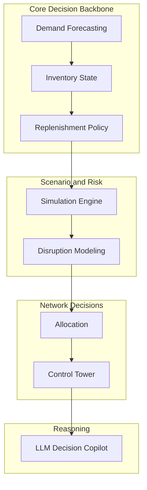

# Module Map

## Purpose

This document defines the major modules of the **Supply Chain AI Lab**.

The system is designed as a **modular retail supply chain decision platform** in which each module solves a specific business problem while sharing common data, decision, simulation, and reasoning layers.

It evolves from a deterministic operational backbone into a broader explainable decision system.

---

## One-Line Summary

The module map shows **what each part of the system does**, **why it exists**, and **how the platform expands from core decisions to network-level intelligence**.

---

## Core Operational Modules

These modules form the **decision backbone** of the system.

### 1. Demand Forecasting

**Purpose**  
Predict future demand at the **SKU × location × time** level.

**Why it matters**  
Forecasting creates the forward-looking demand signal used by downstream decisions.

**Typical outputs**

- demand forecasts
- forecast accuracy metrics
- trend summaries
- volatility indicators

**Mental Hook**  
**What demand should we expect?**

---

### 2. Inventory State

**Purpose**  
Represent the **current health of inventory** for a SKU-location or across the network.

**Why it matters**  
The system must understand current stock conditions before making decisions.

**Typical outputs**

- inventory position
- days of supply
- stockout risk
- service level estimates

**Mental Hook**  
**What is our current supply risk?**

---

### 3. Replenishment Policy

**Purpose**  
Determine **when to reorder and how much to order**.

**Why it matters**  
Replenishment converts forecast + inventory context into an operational action.

**Typical outputs**

- reorder points
- recommended order quantities
- safety stock estimates
- replenishment alerts

**Mental Hook**  
**What action should we take now?**

---

## Scenario and Risk Modules

These modules evaluate how the system behaves under uncertainty.

### 4. Simulation Engine

**Purpose**  
Run the decision pipeline under alternative conditions.

**Examples**

- demand spikes
- promotions
- supplier delays
- inventory shocks

**Typical outputs**

- scenario comparisons
- stockout outcomes
- replenishment impacts
- service level changes

**Mental Hook**  
**What happens if conditions change?**

---

### 5. Disruption / Lead Time Risk

**Purpose**  
Model supply-side uncertainty and operational disruptions.

**Examples**

- supplier delays
- transportation disruptions
- port congestion
- manufacturing interruptions

**Typical outputs**

- disruption alerts
- lead time risk indicators
- supply reliability summaries

**Mental Hook**  
**How resilient is the system to supply uncertainty?**

---

## Network Decision Modules

These modules operate across the **full supply chain network**, not just one SKU-location pair at a time.

### 6. Allocation / Inventory Distribution

**Purpose**  
Decide how limited inventory should be distributed when supply is constrained.

**Why it matters**  
When inventory is scarce, the system must prioritize where product should go first.

**Typical outputs**

- allocation plans
- shortage balancing rules
- location priority decisions

**Mental Hook**  
**Who should receive scarce inventory first?**

---

### 7. Network Metrics / Control Tower

**Purpose**  
Monitor overall system performance and network health.

**Typical metrics**

- fill rate
- service level
- stockout rate
- forecast accuracy
- inventory turnover

**Typical outputs**

- health dashboards
- operational alerts
- network summaries

**Mental Hook**  
**How healthy is the supply chain network?**

---

## Reasoning Layer

### 8. Supply Chain Decision Copilot

**Purpose**  
Use LLM reasoning to interpret deterministic outputs and assist planners.

The LLM does **not** replace planning logic.  
It explains, summarizes, and interprets system behavior.

**Examples**

- explain forecast changes
- summarize disruption causes
- compare scenario outcomes
- generate operational narratives

**Typical outputs**

- operational summaries
- scenario explanations
- decision-support narratives

**Mental Hook**  
**Why did the system make this decision?**

---

## Optional Extensions

These modules are useful expansions but are not required for the core system.

### Assortment Optimization

**Purpose**  
Determine which products should be carried at each location.

**Mental Hook**  
Right product, right store.

---

### Substitution Recommendation

**Purpose**  
Recommend alternatives when products are unavailable.

**Mental Hook**  
What should replace an out-of-stock item?

---

### Promotion Optimization

**Purpose**  
Decide which products should be promoted and when.

**Mental Hook**  
Promotions shape demand intentionally.

---

### Pricing Optimization

**Purpose**  
Adjust prices to balance demand and inventory.

**Mental Hook**  
Price changes demand behavior.

---

### Supplier Intelligence

**Purpose**  
Evaluate supplier reliability and risk exposure.

**Mental Hook**  
Not all suppliers perform equally.

---

## Shared System Layers

All modules rely on common system infrastructure.

Shared layers include:

- retail data model
- feature pipelines
- deterministic decision logic
- simulation engine
- evaluation framework
- reasoning layer

These shared layers keep the modules aligned on the same data structures and execution logic.

---

## How the Modules Fit Together

---

## Build Order

Recommended implementation order:

1. demand forecasting  
2. inventory state  
3. replenishment policy  
4. simulation engine  
5. disruption / lead time risk  
6. allocation / inventory distribution  
7. network metrics / control tower  
8. LLM decision copilot  

This order builds the operational backbone first, then adds uncertainty, network intelligence, monitoring, and explanation.

---

## Mental Model

The system grows in layers:

predict  
→ evaluate  
→ decide  
→ stress test  
→ protect against disruption  
→ allocate across the network  
→ monitor performance  
→ explain outcomes

---

## Final View

This module map shows that the Supply Chain AI Lab is not a single model.

It is a **layered decision system** made of cooperating modules:

- core modules produce operational decisions
- risk modules test robustness
- network modules optimize across locations
- monitoring tracks health
- the reasoning layer explains outputs to humans