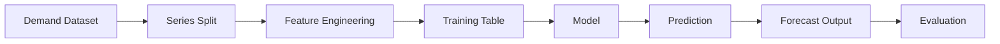

# Demand Forecasting Module Architecture

## Purpose

The demand forecasting module predicts **future demand for each SKU at each location over time**.

It produces the **primary signal that drives all downstream decisions**:

- inventory evaluation
- replenishment
- simulation
- allocation

---

## One-Line Summary

Transforms **historical demand → future demand signals** using a structured, modular pipeline.

---

## Role in System

Forecasting is the **first stage of the decision pipeline**:

Forecast → Inventory → Replenishment → Simulation → Disruption → Allocation → Monitoring → Reasoning

Because it sits at the start, it influences everything downstream.

**Mental Hook:** What demand should we expect?

---

## Module Structure

schemas → data → features → model → evaluate → service

Each layer has one responsibility.

---

## Schemas Layer

Defines structured data contracts:

- `DemandRecord`
- `DemandDataset`
- `ForecastFeatureRow`
- `ForecastPredictionRow`
- `ForecastEvaluationResult`

Purpose:

- enforce consistency
- prevent unstructured data flow
- define internal language

**Mental Hook:** schemas = contracts

---

## Data Layer

Organizes raw demand into time series.

Responsibilities:

- sort chronologically
- group by `(sku_id, location_id)`
- create train/test splits

Flow:

DemandDataset → grouped series

Each series is independent.

**Mental Hook:** raw logs → clean time series

---

## Feature Engineering Layer

Transforms time series into model inputs.

Typical features:

- lag features
- rolling statistics
- optional time features

Flow:

series → feature rows

Each row contains:

- identifiers
- timestamp
- features
- target

**Mental Hook:** history → predictive signals

---

## Model Layer

Trains models and generates predictions.

Examples:

- naive baseline
- linear models
- tree-based models

Flow:

feature rows → model → predictions

Models are interchangeable.

**Mental Hook:** signals → predictions

---

## Evaluation Layer

Measures forecast quality.

Responsibilities:

- compute metrics
- evaluate per series
- evaluate across dataset

Metric:

- Mean Absolute Error (MAE)

**Mental Hook:** how reliable is the forecast?

---

## Service Layer

Provides external interface.

Examples:

- `get_next_step_forecast`
- `get_forecast_horizon`

Responsibilities:

- hide internal logic
- standardize access

**Mental Hook:** forecasting as a callable service

---

## Recursive Multi-Step Forecasting

Supports multi-step prediction via recursion:

history → predict t+1 → append → predict t+2 → repeat

This extends simple models to longer horizons.

**Mental Hook:** one-step → multi-step

---

## Full Pipeline

---

## Architecture Properties

- modular
- extensible
- testable
- explainable

---

## Mental Model

history → structure → features → model → prediction → evaluate

---

## Final View

The module converts **historical demand into future demand signals**, which drive all downstream supply chain decisions.