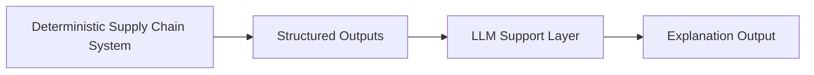
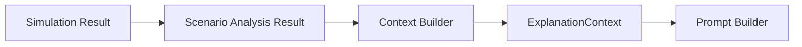
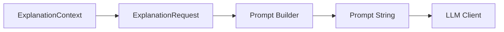
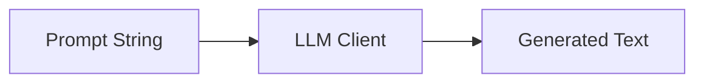
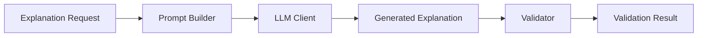
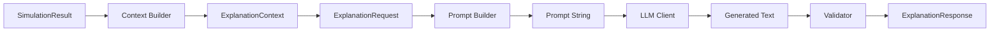
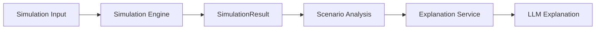
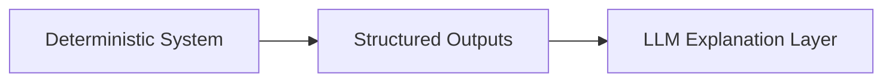

# V3 LLM Layer

## Purpose

V3 adds a grounded LLM explanation layer on top of the deterministic supply chain backbone.

The deterministic system remains the source of truth.  
The LLM layer does not make supply chain decisions.  
It consumes structured outputs from the deterministic system and produces explanation-oriented outputs such as summaries, scenario comparisons, and risk descriptions.

Core rule:

- deterministic system computes  
- LLM layer interprets  

---

## High-Level Placement



The supply chain system computes structured truth.  
The LLM layer consumes that truth and produces explanations.

---

## Step 1: Schema Layer

Location: src/llm_support/schemas.py

This layer defines the structured contract between the deterministic system and the LLM explanation layer.

The LLM does not consume raw system objects.  
It consumes a clean, minimal, explanation-ready structure.

---

## Step 1 Schemas

### ExplanationTask
Defines what the LLM should do:
- simulation summary  
- scenario comparison  
- risk explanation  

### ScenarioExplanationRow
Represents one scenario’s structured facts:
- scenario name  
- reorder decision  
- recommended units  
- delta vs baseline  
- days of supply  
- stockout risk  
- inventory pressure  

Think of this as a single scenario fact card.

### ExplanationContext
Represents the full explanation input:
- baseline facts  
- list of scenario rows  
- optional system note  

Think of this as the full folder of facts.

### ExplanationRequest
Combines:
- task  
- context  

This is the input to the LLM layer.

### ExplanationResponse
Contains:
- task  
- explanation text  

This is the output from the LLM layer.

### ValidationResult
Represents governance result:
- is_valid  
- issues  

This ensures LLM output stays grounded in deterministic truth.

---

## Design Principles

The schema layer is:
- small  
- structured  
- grounded in deterministic outputs  
- free of agent complexity  

It does NOT include:
- planning logic  
- execution envelopes  
- model calls  
- prompt construction  

---

## Mental Model

- ScenarioExplanationRow = one scenario fact card  
- ExplanationContext = full set of facts  
- ExplanationTask = what to do  
- ExplanationRequest = instruction + data  
- ExplanationResponse = explanation  
- ValidationResult = grounding check  

---

## Why This Step Matters

This step defines a stable interface before adding:
- context builder  
- prompt builder  
- LLM client  
- validator  
- service layer  

This prevents drift and keeps the architecture clean.

# Step 2 — Context Builder

## Purpose

The context builder is the bridge between the deterministic V2 system and the V3 LLM layer.

It converts structured scenario analysis output into a stable `ExplanationContext` that can be passed into the prompt builder later.

---

## What it does

Input:
- `ScenarioAnalysisResult`

Output:
- `ExplanationContext`

It extracts:
- the baseline scenario name
- a list of normalized `ScenarioExplanationRow` entries

---

## Why this layer exists

This layer prevents the LLM pipeline from depending directly on internal simulation or analysis objects.

That keeps V3 cleaner because:
- prompt logic does not need to know V2 internals
- future schema changes are easier to contain
- deterministic outputs remain the source of truth

---

## What it does NOT do

The context builder does **not**:
- make decisions
- recalculate business logic
- generate prompt text
- call any LLM
- interpret results beyond field mapping

It is a pure transformation layer.

---

## Mental Model




# Step 3 — Prompt Builder

## Purpose

The prompt builder converts a structured `ExplanationRequest` into a grounded prompt string for the LLM.

It sits between the context builder and the LLM client.

---

## Input

* `ExplanationRequest`

  * `task`
  * `context`
  * optional `question`

---

## Output

* One prompt string

This prompt includes:

* the explanation task
* the baseline scenario
* all structured scenario rows
* optional user question

---

## What this layer does

* Formats structured scenario data into readable text
* Selects instruction style based on task
* Ensures the LLM stays grounded in deterministic outputs

---

## What this layer does NOT do

* No business logic
* No calculations
* No filtering or transformation
* No LLM calls
* No validation

It is strictly a formatting + instruction layer.

---

## Supported Tasks

* `simulation_summary`
* `scenario_comparison`
* `risk_explanation`

Each task changes only the instruction, not the data.

---

## Mental Model



---

## Example Shape

Input (structured):

* baseline
* demand_spike
* supplier_delay

Each with:

* reorder
* recommended_units
* days_of_supply
* stockout_risk
* delta_vs_baseline
* inventory_pressure

---

Output (prompt idea):

* Clear instruction (based on task)
* Baseline reference
* Structured scenario rows
* Optional user question

---

## Design Principle

Deterministic system is the source of truth.

The prompt builder does not invent or modify logic.
It only converts structured outputs into a clear explanation request.

---

## Key Insight

# Prompt builder = *structured facts → clear question for LLM*

# Step 4 — Client

## Purpose

The client is the thinnest possible wrapper around the LLM.

It receives a prompt string and returns generated text.

---

## Input

- prompt string

---

## Output

- generated explanation text

---

## What this layer does

- isolates model access in one place
- provides a clean `generate(prompt)` interface
- keeps provider-specific logic out of builders and service code

---

## What this layer does NOT do

- no context building
- no prompt building
- no validation
- no business logic
- no orchestration

It is only the model connector.

---

## Why the first version is a stub

The initial implementation uses a stub response so the project stays:

- deterministic-first
- runnable without secrets
- GitHub-clean
- easy to extend later

This lets the V3 architecture be completed before introducing any external API dependency.

---

## Mental Model



# Step 5 — Validator

## Purpose

The validator checks whether the LLM explanation stays grounded in the structured deterministic request.

It sits after the client and before the final response is accepted.

---

## Input

- generated explanation text
- `ExplanationRequest`

---

## Output

- `ValidationResult`
  - `is_valid`
  - `issues`

---

## What this layer does

- checks that the explanation is not empty
- checks that the explanation is not trivially short
- checks that it references known scenario names
- applies task-specific validation rules

---

## Why task-aware validation is needed

Different explanation tasks require different validation expectations.

Examples:
- `simulation_summary` may not need explicit risk terms
- `scenario_comparison` should reference the baseline
- `risk_explanation` should mention risk-related signals

Because of this, validation should depend on the explanation task rather than enforcing one rigid rule for all outputs.

---

## Why we removed forbidden phrase lists

The validator does not try to block specific words such as "seasonality" or "market trends."

That approach is brittle and can create false positives.

Instead, the validator uses a cleaner principle:
- check whether the explanation stays grounded in known structured signals
- apply lightweight task-aware checks
- avoid naive keyword banning

---

## Task-Specific Rules

### `simulation_summary`
- light validation only
- mainly checks grounding and basic usefulness

### `scenario_comparison`
- should reference the baseline scenario

### `risk_explanation`
- must mention at least one key risk signal:
  - days of supply
  - stockout risk
  - inventory pressure

---

## What this layer does NOT do

- no text rewriting
- no re-prompting
- no business logic
- no semantic scoring
- no LLM call

It only validates and reports.

---

## Validation Philosophy

The validator is intentionally lightweight:

- rule-based
- transparent
- easy to understand
- easy to extend later

This keeps the system interview-friendly and avoids overengineering.

---

## Mental Model



# Step 6 — Service

## Purpose

The service orchestrates the full V3 explanation flow.

It is the single entry point for the LLM explanation layer.

---

## Input

- `SimulationResult`
- explanation `task`
- optional `question`

---

## Output

- `ExplanationResponse`

---

## Flow



# Step 7 — System Runner Integration (V3 LLM Layer)

## Purpose

Integrate the LLM explanation layer into the system runner without modifying the deterministic pipeline.

The LLM is invoked only after simulation and analysis are complete.

---

## Where LLM is Integrated

LLM is triggered only in:

* `mode = "simulation"`

Because:

* simulation produces scenario comparisons
* analysis layer provides structured signals
* LLM explains those signals

---

## Updated Flow (Simulation Mode)



---

## Key Design Rule

LLM is an **optional interpretation layer**, not part of core logic.

* deterministic system runs independently
* LLM runs only if requested
* no decision logic depends on LLM

---

## Input Changes

### `SystemRunnerInput`

Added:

* `explanation_task`
* `explanation_question`

These define:

* what kind of explanation is requested
* optional user-specific instruction

---

## Output Changes

### `SystemRunnerResult`

Added:

* `llm_explanation`

This contains:

* explanation text
* model metadata
* task type

---

## Execution Logic

Inside `system_runner/service.py`:

1. Run simulation
2. If `explanation_task` is provided:

   * call `LLMExplanationService`
3. Attach result to `SystemRunnerResult`

---

## Separation of Responsibilities

| Component         | Responsibility             |
| ----------------- | -------------------------- |
| Simulation Engine | Generate scenario outcomes |
| Scenario Analysis | Compute structured signals |
| LLM Service       | Explain results            |
| System Runner     | Orchestrate execution      |

---

## Why This Design Works

* no refactor of existing modules
* no coupling between LLM and core system
* deterministic system remains source of truth
* easy to disable or replace LLM

---

## Example Usage

```python
system_input = build_simulation_runner_input(
    explanation_task="scenario_comparison"
)
```

Then:

```python
result = run_supply_chain_system(config, system_input)
```

Output includes:

* `simulation_result`
* `llm_explanation` (if requested)

---

## Mental Model



LLM does not change outputs.
It only explains them.

---

## Key Insight

-  LLM = explanation layer on top of deterministic system
